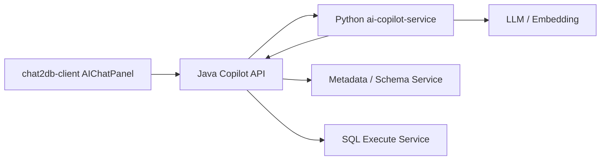

**AI Copilot 落地设计文档**

**1. 目标**
重构 Chat2DB 的 AI 对话能力为可开发、可演进、可评估的 `AI SQL Copilot`。核心目标：
- 多轮对话可持续理解上下文
- SQL 生成可执行、可修复、可追问
- 前端只负责展示，编排下沉后端
- Java 保留数据源/执行/权限，Python 负责 AI 编排

**2. 总体架构**


**3. 职责划分**
`Java`
- 对前端暴露统一 AI 接口
- 鉴权、权限、审计、限流
- 数据源元数据查询
- SQL 安全检查与执行
- SSE 流式转发

`Python`
- 会话状态管理
- 意图识别与任务规划
- schema 召回与排序
- SQL 生成、校验、修复
- 结果总结与追问处理
- trace/eval 记录

**4. Java 侧改造点**
新增模块建议：
- `chat2db-server-web/.../controller/copilot`
- `chat2db-server-web/.../service/copilot`
- `chat2db-server-domain/.../copilot/model`
- `chat2db-server-domain/.../copilot/internal`

新增接口：
1. `POST /api/ai/copilot/chat`
用途：前端统一入口，返回 SSE  
请求：
```json
{
  "sessionId": "optional",
  "message": "帮我查最近30天成交额最高的10个客户",
  "datasourceContext": {
    "dataSourceId": 1,
    "databaseName": "crm",
    "schemaName": ""
  }
}
```

2. `POST /internal/ai/schema/search`
用途：给 Python 返回结构化 schema 召回原料

3. `POST /internal/ai/schema/table-detail`
用途：按表拉取完整字段、索引、注释、DDL、外键信息

4. `POST /internal/ai/sql/validate`
用途：做 SQL 风险校验、方言基础校验、只读判定

5. `POST /internal/ai/sql/execute`
用途：执行 SQL，返回结构化结果

**5. Python 服务设计**
服务名：`ai-copilot-service`

推荐目录：
```text
ai-copilot-service/
  app/main.py
  app/api/routes.py
  app/core/config.py
  app/core/models.py
  app/workflow/copilot_graph.py
  app/workflow/state.py
  app/services/session_service.py
  app/services/intent_service.py
  app/services/schema_recall_service.py
  app/services/sql_reasoner_service.py
  app/services/sql_repair_service.py
  app/services/answer_service.py
  app/clients/java_backend_client.py
  app/clients/llm_client.py
  app/storage/redis_store.py
  app/storage/sqlite_trace_repo.py
  tests/
```

**6. Python 工作流**
状态对象：
```python
CopilotState:
  session_id: str
  user_id: str | None
  message: str
  datasource_context: dict
  intent: str | None
  need_clarification: bool
  missing_slots: list[str]
  recalled_schema: dict
  generated_sql: str | None
  validated_sql: str | None
  execution_result: dict | None
  final_answer: str | None
  trace_id: str
```

工作流顺序：
1. `load_session`
2. `detect_intent`
3. `decide_clarification`
4. `recall_schema`
5. `generate_sql`
6. `validate_sql`
7. `execute_sql`
8. `repair_sql_if_needed`
9. `summarize_answer`
10. `save_session`

**7. Intent 设计**
意图枚举：
- `CHAT`
- `NL2SQL`
- `SQL_EXPLAIN`
- `SQL_OPTIMIZE`
- `SQL_FIX`
- `RESULT_FOLLOW_UP`

识别输出：
```json
{
  "intent": "NL2SQL",
  "needClarification": false,
  "missingSlots": [],
  "reasoning": "用户请求查询业务数据"
}
```

**8. Schema Recall 设计**
Java 返回基础原料，Python 负责排序。召回策略：
- 表名关键词匹配
- 字段名关键词匹配
- 注释匹配
- 向量召回
- 外键/join path 提升分
- 历史会话中用过的表提升分

输出：
```json
{
  "tables": [
    {
      "name": "orders",
      "score": 0.93,
      "comment": "订单表",
      "columns": ["id", "user_id", "amount", "created_at", "status"]
    }
  ],
  "joinPaths": [
    {"left": "orders.user_id", "right": "users.id"}
  ]
}
```

**9. SQL 生成规范**
LLM 输出必须结构化：
```json
{
  "sql": "SELECT ...",
  "assumptions": ["最近30天按created_at过滤"],
  "explanation": "简要说明"
}
```
生成约束：
- 默认只生成单条 SQL
- 默认查询类自动加 LIMIT
- DML/DDL 标记 `requires_confirmation=true`
- 不允许 markdown code fence
- 不允许解释混入 SQL 字段

**10. SQL 校验与执行**
Java `/internal/ai/sql/validate` 返回：
```json
{
  "ok": true,
  "sqlType": "SELECT",
  "readOnly": true,
  "requiresConfirmation": false,
  "warnings": []
}
```
Java `/internal/ai/sql/execute` 返回：
```json
{
  "success": true,
  "columns": ["customer_name", "total_amount"],
  "rows": [["A公司", 998000]],
  "rowCount": 10,
  "message": null
}
```
失败时：
```json
{
  "success": false,
  "errorCode": "COLUMN_NOT_FOUND",
  "message": "Unknown column 'xxx'"
}
```

**11. 会话存储**
`Redis`
- `copilot:session:{sessionId}` 存 `CopilotState`
- TTL 30 分钟

建议同时落 trace 到 SQLite/Postgres：
表：
- `ai_session`
- `ai_turn`
- `ai_trace`
- `ai_sql_execution`

最少字段：
`ai_turn`
- `id`
- `session_id`
- `user_message`
- `intent`
- `recalled_tables_json`
- `generated_sql`
- `validated_sql`
- `execution_status`
- `final_answer`
- `created_at`

**12. SSE 事件协议**
Java 对前端统一流式事件：
```json
{"type":"session","data":{"sessionId":"xxx","traceId":"yyy"}}
{"type":"status","data":"正在理解问题"}
{"type":"plan","data":{"intent":"NL2SQL"}}
{"type":"schema","data":{"tables":["orders","users"]}}
{"type":"sql","data":{"content":"SELECT ..."}}
{"type":"confirm","data":{"required":true,"sql":"DELETE ..."}}
{"type":"result","data":{"rowCount":10}}
{"type":"answer","data":{"content":"最近30天成交额最高的10个客户是..."}}
{"type":"done","data":{}}
{"type":"error","data":{"message":"..."}}
```

**13. 前端改造要求**
修改 [AIChatPanel](/Users/pdq/Documents/Cscs/AI_PROJECT/Chat2DB/chat2db-client/src/pages/main/workspace/components/AIChatPanel/index.tsx)：
- 删除前端串行 pipeline
- 改为单次调用 `/api/ai/copilot/chat`
- 根据 `type` 展示状态、SQL、确认框、最终答案
- 保留“新会话”“继续追问”“确认执行”能力
- 不再本地修 SQL、总结结果、自己维持内部 SSE

**14. 最小可开发版本 MVP**
第一版必须实现：
- `POST /api/ai/copilot/chat`
- Java 3 个 internal 接口：`schema/search`、`sql/validate`、`sql/execute`
- Python 单工作流：`NL2SQL -> validate -> execute -> summarize`
- Redis session
- 基础 SSE 协议
- SELECT 可用，DML/DDL 仅确认，不自动执行

**15. 开发顺序**
1. Java：定义 DTO、internal API、copilot chat controller
2. Python：搭建 FastAPI、state、java client、llm client
3. Python：先完成 `NL2SQL` 主链路
4. Java：前端 SSE 转发
5. 前端：改成事件驱动展示
6. Python：补 `repair_sql_if_needed`
7. Python：补 `RESULT_FOLLOW_UP`

**16. 验收标准**
- 用户输入长文本不再被截断
- 同 session 下追问能引用上轮 SQL/结果
- 复杂查询能稳定召回相关表
- SQL 执行失败可自动修复至少一次
- 前端不再出现多段 AI prompt 链路
- trace 可查看每轮：意图、召回表、SQL、执行结果、最终回答

**17. 明确不做**
第一版不做：
- 全自动复杂 agent 自主探索
- 多 SQL 候选投票
- 图表自动生成
- 跨数据源联邦查询
- 大规模长期 memory

**18. 给 Claude 的直接开发指令建议**
你可以让 Claude 按这个顺序开工：
1. 在 Java 中新增 `CopilotChatController`、`CopilotInternalController` 和相关 DTO
2. 在 Python 中创建 `ai-copilot-service`，实现 `POST /ai/copilot/run`
3. 打通 Java `schema/search`、`sql/validate`、`sql/execute`
4. 实现 Redis session 和基本工作流
5. 将前端 `AIChatPanel` 改为消费统一 SSE 事件

